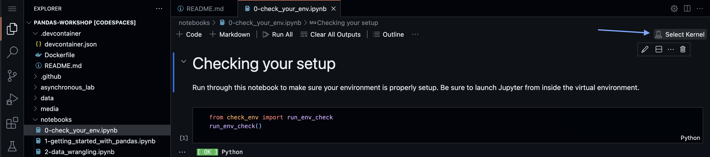
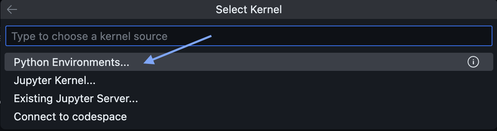

# Welcome to the devcontainer for Introduction to Data Analysis Using Python!

**IMPORTANT**: Open this file using the preview option to render the images (right-click the file in the left sidebar, and click **Open Preview**).

---

You will be running through the workshop in [Visual Studio Code](https://code.visualstudio.com/) using the Jupyter extension to interact with Jupyter Notebooks. Each time you open a new Jupyter Notebook, you will need to select the kernel (specify the virtual environment to use).

Start by opening up the [`notebooks/0-check_your_env.ipynb`](../notebooks/0-check_your_env.ipynb) notebook and clicking the **Select Kernel** button at the top right:

Select the **Python Environments...** option:

Select the **pandas_workshop** option (the Python version can vary):

Use `pandas_workshop` for all subsequent notebooks. Note that you can close the bottom panel (**TERMINAL**) for more space.
