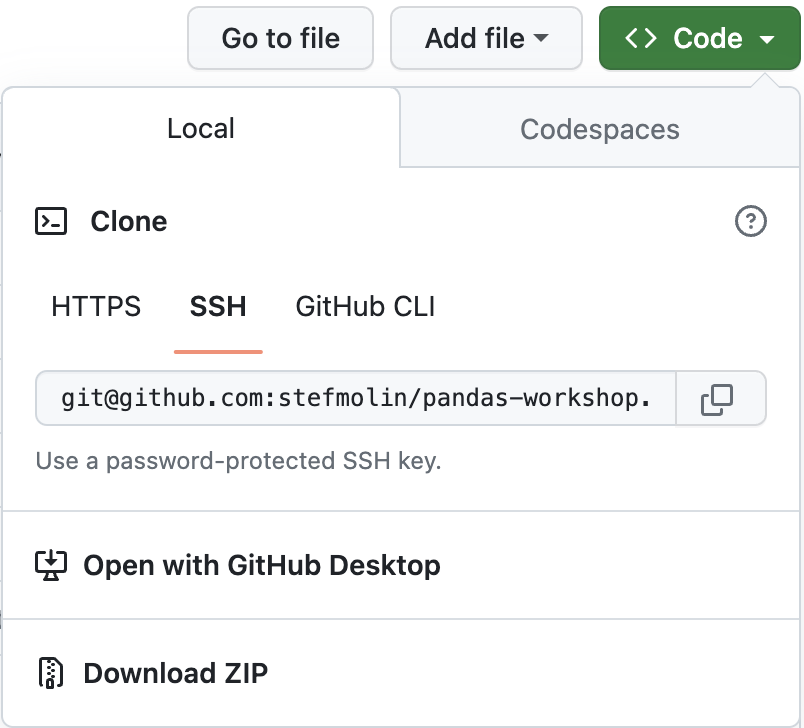
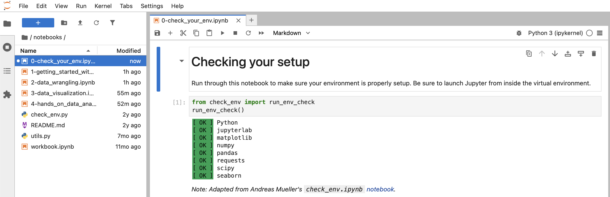
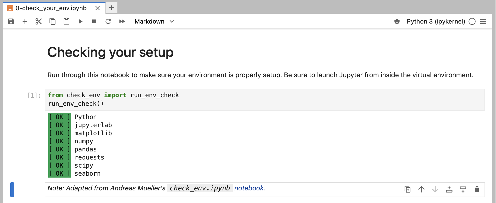
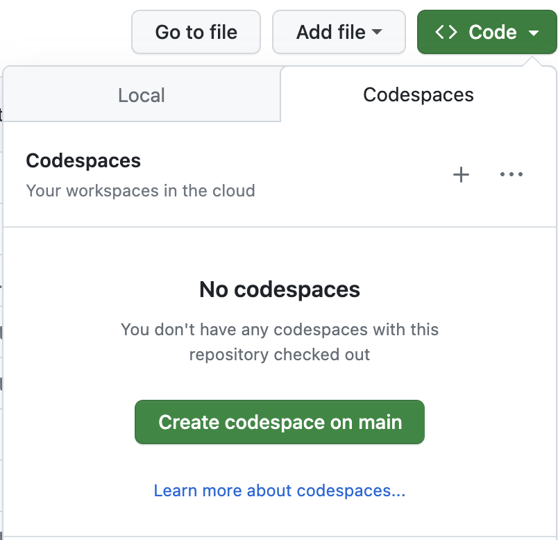
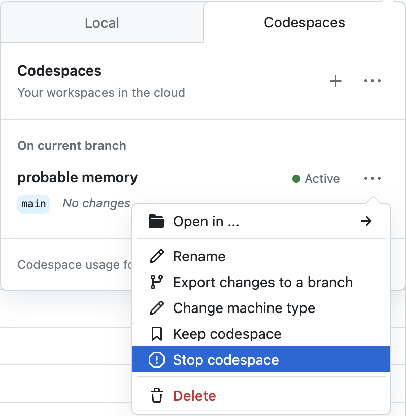
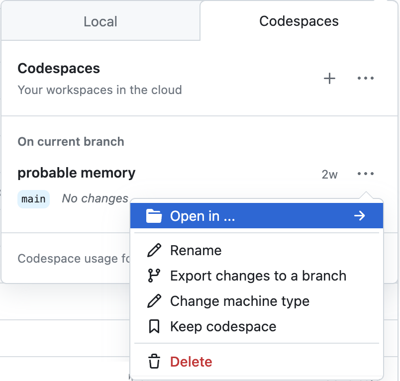

# Pandas Workshop

[](https://nbviewer.jupyter.org/github/stefmolin/pandas-workshop/tree/main/) [](https://github.com/stefmolin/pandas-workshop/actions/workflows/env-checks.yml)  [](https://stefmolin.github.io/pandas-workshop/slides/html/workshop.slides.html#/)

Working with data can be challenging: it often doesn’t come in the best format for analysis, and understanding it well enough to extract insights requires both time and the skills to filter, aggregate, reshape, and visualize it. This session will equip you with the knowledge you need to effectively use pandas – a powerful library for data analysis in Python – to make this process easier.

Pandas makes it possible to work with tabular data and perform all parts of the analysis from collection and manipulation through aggregation and visualization. While most of this session focuses on pandas, during our discussion of visualization, we will also introduce at a high level Matplotlib (the library that pandas uses for its visualization features, which when used directly makes it possible to create custom layouts, add annotations, etc.) and Seaborn (another plotting library, which features additional plot types and the ability to visualize long-format data).

## Session Outline

This is an introductory workshop on pandas first delivered at [ODSC Europe 2021](https://odsc.com/speakers/introduction-to-data-analysis-using-pandas/) and subsequently at the [5th Annual Toronto Machine Learning Summit](https://www.torontomachinelearning.com/events/introduction-to-data-analysis-using-pandas/) in 2021, [PyCon US 2022](https://us.pycon.org/2022/schedule/presentation/24/), and [ODSC Europe 2023](https://odsc.com/speakers/introduction-to-data-analysis-using-pandas/), along with abbreviated versions at [PyCon UK 2022](https://pretalx.com/pycon-uk-2022/talk/LZKN7F/), [PyCon Portugal 2022](https://pretalx.evolutio.pt/pyconpt2022/talk/TUZZMY/), and [EuroSciPy 2023](https://pretalx.com/euroscipy-2023/talk/PWER3Z/). It's divided into the following sections:

### Section 1: Getting Started With Pandas
We will begin by introducing the `Series`, `DataFrame`, and `Index` classes, which are the basic building blocks of the pandas library, and showing how to work with them. By the end of this section, you will be able to create DataFrames and perform operations on them to inspect and filter the data.

### Section 2: Data Wrangling
To prepare our data for analysis, we need to perform data wrangling. In this section, we will learn how to clean and reformat data (e.g., renaming columns and fixing data type mismatches), restructure/reshape it, and enrich it (e.g., discretizing columns, calculating aggregations, and combining data sources).

### Section 3: Data Visualization
The human brain excels at finding patterns in visual representations of the data; so in this section, we will learn how to visualize data using pandas along with the Matplotlib and Seaborn libraries for additional features. We will create a variety of visualizations that will help us better understand our data.

### Section 4: Hands-On Data Analysis Lab
We will practice all that you’ve learned in a hands-on lab. This section features a set of analysis tasks that provide opportunities to apply the material from the previous sections.

---

## Prerequisites
You should have basic knowledge of Python and be comfortable working in Jupyter Notebooks. Check out [this notebook](https://github.com/stefmolin/Hands-On-Data-Analysis-with-Pandas-2nd-edition/blob/master/ch_01/python_101.ipynb) for a crash course in Python or work through the [official Python tutorial](https://docs.python.org/3/tutorial/) for a more formal introduction. The environment we will use for this workshop comes with JupyterLab, which is pretty intuitive, but be sure to familiarize yourself [using notebooks in JupyterLab](https://jupyterlab.readthedocs.io/en/latest/user/notebook.html) and [additional functionality in JupyterLab](https://dzone.com/articles/getting-started-with-jupyterlab).

---

## Setup Instructions
You can work through the notebooks locally or in your browser. Pick the installation option that makes sense for you.

### Local Installation
**Warning**: It is highly recommended that you use your personal laptop for the installation.

0. Install Python >= version 3.8 and <= version 3.11 OR install [Anaconda](https://docs.anaconda.com/anaconda/install/)/[Miniconda](https://docs.conda.io/en/latest/miniconda.html). Note that Anaconda/Miniconda is recommended if you are working on a Windows machine and are not very comfortable with the command line. Alternatively, depending on server availability, you can use [this](https://mybinder.org/v2/gh/stefmolin/pandas-workshop/main?urlpath=lab) Binder environment if you don't want to install anything on your machine.
1. Fork this repository:

    

2. Navigate to your fork, and click the **Code** button:

    

3. Clone your forked repository using the desired method from the **Local** tab:

    

4. Create and activate a Python virtual environment:
    - If you installed Anaconda/Miniconda, use `conda` (on Windows, these commands should be run in **Anaconda Prompt**):

        ```shell
        $ cd pandas-workshop
        ~/pandas-workshop$ conda env create --file environment.yml
        ~/pandas-workshop$ conda activate pandas_workshop
        (pandas_workshop) ~/pandas-workshop$
        ```

    - Otherwise, use `venv`:

        ```shell
        $ cd pandas-workshop
        ~/pandas-workshop$ python3 -m venv pandas_workshop
        ~/pandas-workshop$ source pandas_workshop/bin/activate
        (pandas_workshop) ~/pandas-workshop$ pip3 install -r requirements.txt
        ```

5. Launch JupyterLab:

    ```shell
    (pandas_workshop) ~/pandas-workshop$ jupyter lab
    ```

6. Navigate to the `0-check_your_env.ipynb` notebook in the `notebooks/` folder:

    

7. Run the notebook to confirm everything is set up properly:

    


### Cloud Options

#### GitHub Codespaces

[](https://codespaces.new/stefmolin/pandas-workshop)

The [GitHub Codespaces](https://github.com/features/codespaces) setup provides a pre-configured machine accessible via your browser. You will need a GitHub account and available quota (all users get more than enough free monthly quota to be able to run this workshop). Note that this will take a while to build. It's recommended that you click the badge above to build the codespace in advance of the workshop and then [stop the codespace](https://docs.github.com/en/codespaces/developing-in-codespaces/stopping-and-starting-a-codespace) until the workshop, at which point you can simply resume and pick up where you left off.

Note that if you want to save your changes, you will need to fork the repository before creating the codespace. You will then be able to commit your changes directly from the codespace. Be sure to create your codespace in advance of the session and resume when we start.

1. Fork this repository:

    

2. Navigate to your fork, and click the **Code** button:

    

3. Launch the codespace from your fork by clicking on the **+** or **Create codespace on main** button in the **Codespaces** tab:

    

4. Stop the codespace until the session starts by selecting **Stop codespace** from the **...** menu.

    

5. To resume the codespace, click **Open in ...** and then select your preferred method. If you aren't sure, select JupyterLab.

    

#### Binder

[](https://mybinder.org/v2/gh/stefmolin/pandas-workshop/main?urlpath=lab/tree/notebooks)

Depending on server availability, you can use [this](https://mybinder.org/v2/gh/stefmolin/pandas-workshop/main?urlpath=lab) Binder environment, which does not require the creation of a GitHub account. **There is no guarantee that you will be able to access this during the workshop.**

---

## About the Author
Stefanie Molin ([@stefmolin](https://github.com/stefmolin)) is a software engineer and data scientist at Bloomberg in New York City, where she tackles tough problems in information security, particularly those revolving around data wrangling/visualization, building tools for gathering data, and knowledge sharing. She is also the author of [Hands-On Data Analysis with Pandas](https://www.amazon.com/dp/1800563450/), which is currently in its second edition and has been translated into Korean. She holds a bachelor’s of science degree in operations research from Columbia University's Fu Foundation School of Engineering and Applied Science, as well as a master’s degree in computer science, with a specialization in machine learning, from Georgia Tech. In her free time, she enjoys traveling the world, inventing new recipes, and learning new languages spoken among both people and computers.

## Related Content
All examples herein were developed exclusively for this workshop. [Hands-On Data Analysis with Pandas](https://www.amazon.com/dp/1800563450/) contains additional examples and exercises, as does [this](https://medium.com/@stefaniemolin/how-to-pivot-and-plot-data-with-pandas-9450939fcf8) blog post. For a deeper dive into data visualization in Python, check out my [Beyond the Basics: Data Visualization in Python](https://github.com/stefmolin/python-data-viz-workshop) workshop.
