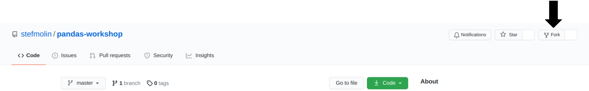
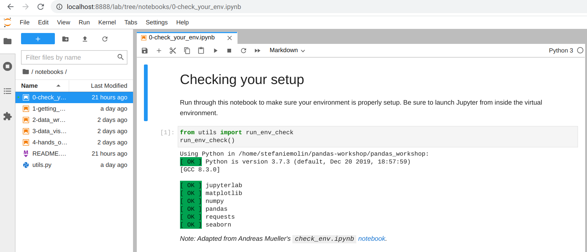
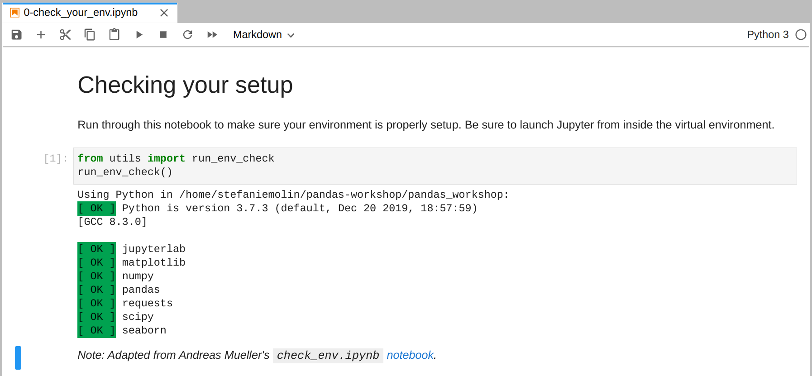

# Pandas Workshop

[](https://mybinder.org/v2/gh/stefmolin/binder-environments/pandas_workshop?urlpath=git-pull%3Frepo%3Dhttps%253A%252F%252Fgithub.com%252Fstefmolin%252Fpandas-workshop%26urlpath%3Dlab%252Ftree%252Fpandas-workshop%252F%26branch%3Dmaster) [](https://nbviewer.jupyter.org/github/stefmolin/pandas-workshop/tree/master/) [](https://stefmolin.github.io/pandas-workshop/slides/html/combined.slides.html#/)

Working with data can be challenging: it often doesn’t come in the best format for analysis, and understanding it well enough to extract insights requires both time and the skills to filter, aggregate, reshape, and visualize it. This session will equip you with the knowledge you need to effectively use pandas – a powerful library for data analysis in Python – to make this process easier.

Pandas makes it possible to work with tabular data and perform all parts of the analysis from collection and manipulation through aggregation and visualization. While most of this session focuses on pandas, during our discussion of visualization, we will also introduce at a high level matplotlib (the library that pandas uses for its visualization features, which when used directly makes it possible to create custom layouts, add annotations, etc.) and seaborn (another plotting library, which features additional plot types and the ability to visualize long-format data).

## Session Outline

This is a 3-hour workshop on pandas first delivered at [ODSC Europe 2021](https://odsc.com/speakers/introduction-to-data-analysis-using-pandas/). It's divided into the following sections:

### Section 1: Getting Started With Pandas
We will begin by introducing the `Series`, `DataFrame`, and `Index` classes, which are the basic building blocks of the pandas library, and showing how to work with them. By the end of this section, you will be able to create DataFrames and perform operations on them to inspect and filter the data.

### Section 2: Data Wrangling
To prepare our data for analysis, we need to perform data wrangling. In this section, we will learn how to clean and reformat data (e.g. renaming columns, fixing data type mismatches), restructure/reshape it, and enrich it (e.g. discretizing columns, calculating aggregations, combining data sources).

### Section 3: Data Visualization
The human brain excels at finding patterns in visual representations of the data; so in this section, we will learn how to visualize data using pandas along with the matplotlib and seaborn libraries for additional features. We will create a variety of visualizations that will help us better understand our data.

### Section 4: Hands-On Data Analysis Lab
We will practice all that you’ve learned in a hands-on lab. This section features a set of analysis tasks that provide opportunities to apply the material from the previous sections.

---

## Prerequisites
You should have basic knowledge of Python and be comfortable working in Jupyter Notebooks. Check out [this notebook](https://github.com/stefmolin/Hands-On-Data-Analysis-with-Pandas-2nd-edition/blob/master/ch_01/python_101.ipynb) for a crash course in Python or work through the [official Python tutorial](https://docs.python.org/3/tutorial/) for a more formal introduction. The environment we will use for this workshop comes with JupyterLab, which is pretty intuitive, but be sure to familiarize yourself [using notebooks in JupyterLab](https://jupyterlab.readthedocs.io/en/latest/user/notebook.html) and [additional functionality in JupyterLab](https://dzone.com/articles/getting-started-with-jupyterlab).

---

## Setup Instructions
0. Install Python >= version 3.7.1 and < version 3.9 OR install [Anaconda](https://docs.anaconda.com/anaconda/install/)/[Miniconda](https://docs.conda.io/en/latest/miniconda.html). Note that Anaconda/Miniconda is recommended if you are working on a Windows machine and are not very comfortable with the command line.
1. Fork this repository:

    

2. Clone your forked repository:

    

3. Create and activate a Python virtual environment:
    - If you installed Anaconda/Miniconda, use `conda` (on Windows, these commands should be run in **Anaconda Prompt**):

        ```shell
        $ cd pandas-workshop
        ~/pandas-workshop$ conda env create --file environment.yml
        ~/pandas-workshop$ conda activate pandas_workshop
        (pandas_workshop) ~/pandas-workshop$
        ```

    - Otherwise, use `venv`:

        ```shell
        $ cd pandas-workshop
        ~/pandas-workshop$ python3 -m venv pandas_workshop
        ~/pandas-workshop$ source pandas_workshop/bin/activate
        (pandas_workshop) ~/pandas-workshop$ pip3 install -r requirements.txt
        ```

4. Launch JupyterLab:

    ```shell
    (pandas_workshop) ~/pandas-workshop$ jupyter lab
    ```

5. Navigate to the `0-check_your_env.ipynb` notebook in the `notebooks/` folder:

    

6. Run the notebook to confirm everything is set up properly:

    

---

## About the Author
Stefanie Molin ([@stefmolin](https://github.com/stefmolin)) is a data scientist and software engineer at Bloomberg in New York City, where she tackles tough problems in information security, particularly those revolving around anomaly detection, building tools for gathering data, and knowledge sharing. She is also the author of [Hands-On Data Analysis with Pandas](https://www.amazon.com/dp/1800563450/), which is currently on in its second edition. She holds a bachelor’s of science degree in operations research from Columbia University's Fu Foundation School of Engineering and Applied Science. She is currently pursuing a master’s degree in computer science, with a specialization in machine learning, from Georgia Tech. In her free time, she enjoys traveling the world, inventing new recipes, and learning new languages spoken among both people and computers.


## Related Content
All examples herein were developed exclusively for this workshop. [Hands-On Data Analysis with Pandas](https://www.amazon.com/dp/1800563450/) contains additional examples and exercises, as does [this](https://opendatascience.com/how-to-pivot-and-plot-data-with-pandas/) blog post.
